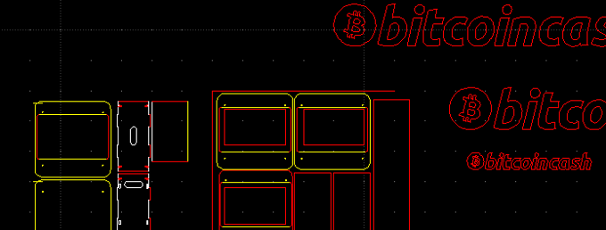

# A simple Bitcoin Cash ATM

## Summary

MiniATM is a compact and simple Bitcoin Cash ATM.
Easy to use and to reproduce, open source and low-cost.
Simple one-way Fiat-to-Crypto exchange to spread BCH adoption. 

1/3 the size and price of existing market solutions.

Designed for DIY fabrication with off-the-shelf components. 
Anyone is free to build and distribute units locally, where ever they may be. 
Comprised only of a tablet computer, bill validator and a laser-cut
acrylic structure. Make or purchase as a KIT with a price target under 1000$.

Units are securely fixed on walls by tamper proof metal brackets. 
Anti-theft cables are used for over-the-counter locations. 

https://www.youtube.com/watch?v=JPtrLKAc8lQ

## Goals

* Make and ship the first 30 MiniATM units 
* Licence exclusively for BCH chain.
* Open source and document for 3rd party fabrication    
* Sell kits and assembled units
* Continued support and feedback to and from the BCH community 
